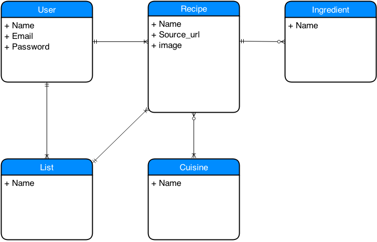

#What Can iCook

### GA WDI DC August 2014, Project 3

###Overview
**iCook** is a cooking app that gives you recipes you can make based on ingredients you already have. It was developed as a sample Rails project for the August 2014 Web Development Immersive course at General Assembly. It was developed over a one week sprint to model the agile software development process.

###Technologies Used
* Ruby 2.1.1
* Ruby on Rails 4.1.1
* Yummly API
* RSpec Rails gem for RSpec testing 
* Shoulda-matchers gem for testing
* PostgreSQL Database
* Devise gem for authentication and authorization.
* Javascript
* Custom styling with CSS3 and HTML5

###User Stories Completed
* As a user I can: 
  * register for an account
  * sign in
  * sign out
  * view a list of searchable ingredients
  * select a single ingredient or a collection of ingredients
  * view my selected ingredient(s)
  * view a list of recipes (based on my ingredients)
    * recipe name and link for its search page on Google (the Yummly API does not require external links directly to the recipe itself)
    * Yummly 0-5 rating
    * recipe photo
  * click on a recipe name 

###Backlog
A full list of user stories can be found by looking at [this Pivitol Tracker Project](https://www.pivotaltracker.com/s/projects/1195886)

###ERD 

###Local Setup
    rake db:create
    bundle install
    rake db:migrate
    rake db:seed
    rails s

    Open the page locally on http://localhost:3000.
    Note that you will need to request access token and an API key for the Yummly API and replace them as appropriate within the code.

---
######Written by Lisa Snider
